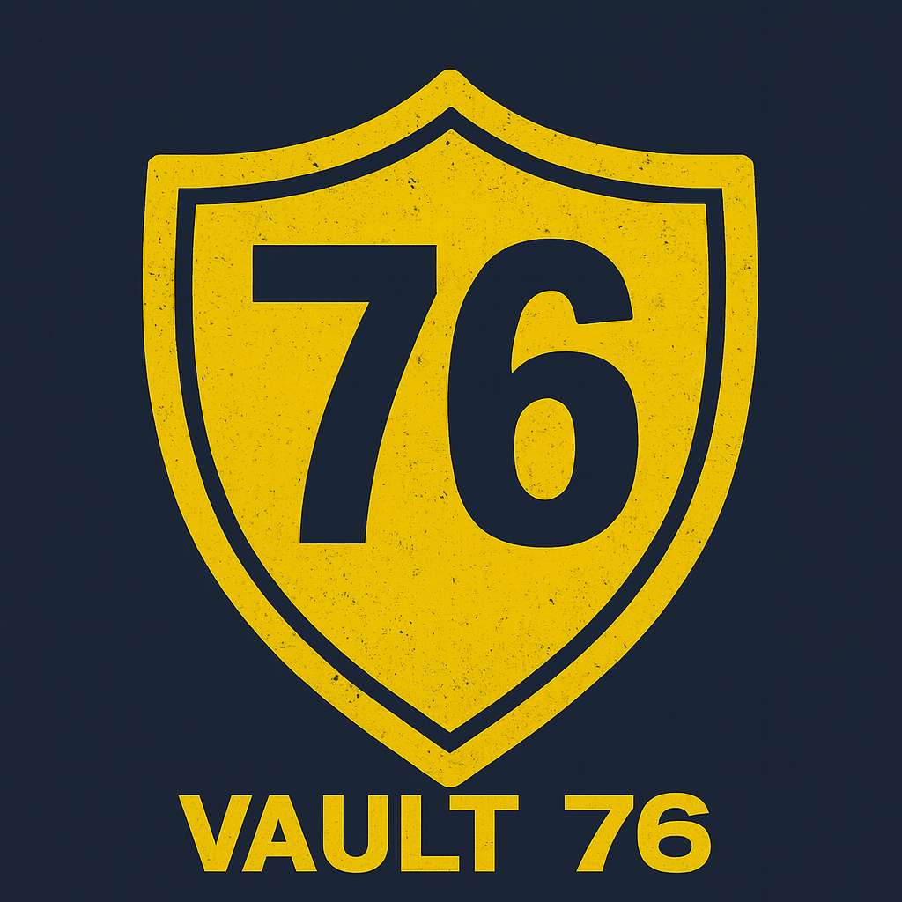

  

# Vault-76 Password Manager

## 🛡️ Sobre o Projeto

O **Vault-76 Password Manager** é um projeto criado com o intuito de desenvolver um **gerenciador de senhas empresarial**, oferecendo segurança, organização e praticidade para equipes que precisam gerenciar credenciais de forma eficiente.

## 🏃‍♂️ Objetivo

O objetivo principal do projeto é fornecer uma solução segura e intuitiva para armazenar, proteger e compartilhar senhas dentro de um ambiente corporativo, garantindo:

* 🔐 **Alta segurança** para dados sensíveis
* 👥 **Acesso controlado** entre colaboradores
* 🛠️ **Facilidade de uso** e integração com fluxos de trabalho
* 📊 **Organização eficiente** de credenciais e informações confidenciais

## 💻 Funcionalidades (propostas)

* Armazenamento seguro com criptografia avançada
* Autenticação em múltiplos fatores (MFA)
* Interface intuitiva e responsiva

## 📁 Estrutura do Projeto

*(Adicionar conforme o desenvolvimento avançar)*

## 📞 Contato

Caso precise de melhorias, sugestões ou tenha dúvidas, sinta-se à vontade para entrar em contato!

---

